# ProQuiz

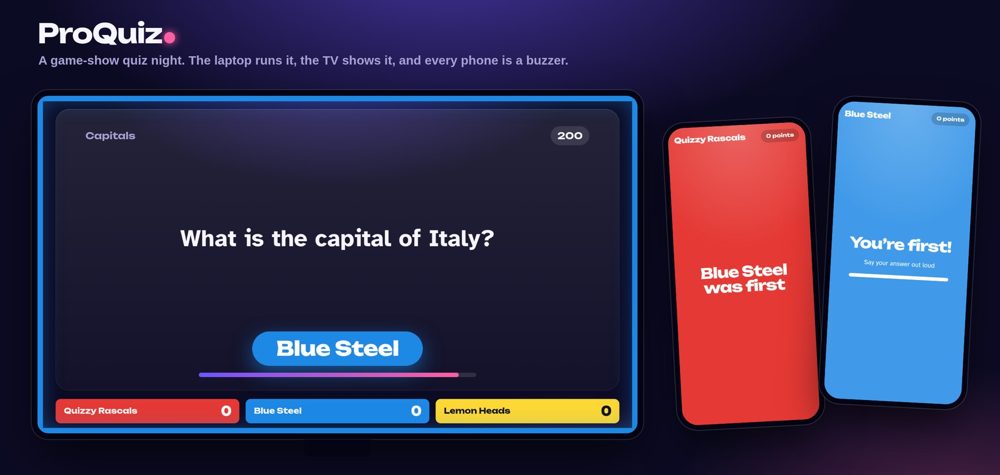

A Jeopardy-style quiz for teams in the same room. A laptop runs the game, a TV shows the board, and every team uses a phone as a buzzer. No internet is needed: everything runs over the room's Wi-Fi.

- A board of categories and questions (100–500 points). The team that answers right picks the next question.
- Phones buzz in, and the first team is shown on the TV in its colour. A wrong answer costs points (none, half or all, your choice), and the other teams can try.
- Game-show sounds, a different buzz note for each team, and timers.
- Background music, Kahoot style: a lobby tune, thinking music while the buzzers are on, suspense in the final, and party music at the end. You can swap in your own music files.
- Pictures and sound clips in questions ("Which song is this?"). A picture can start as big blocks and slowly become clear.
- A final round: teams bet, type their answers on their phones, and you judge each one.
- A question editor, English and Norwegian, and an autosave that survives a crash.
- **Crazy mode (Kaosmodus):** hidden special tiles, revealed on the TV with a spinning reel. They include bombs, triple points, a hot seat, a rescue for the team in last place, a three-question turbo, a jackpot and a freeze.

## Screenshots

**On the TV**

| | |
|---|---|
| 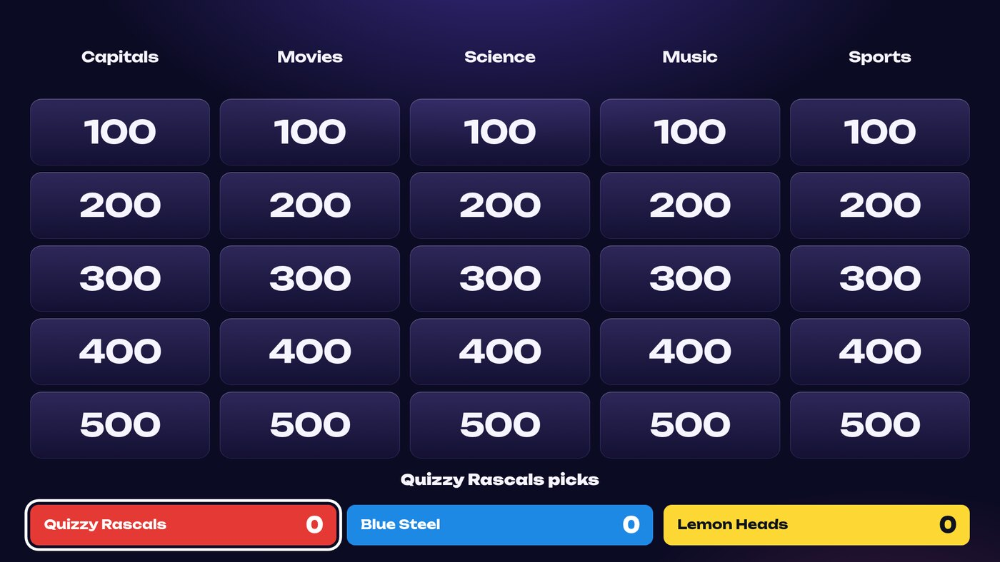 | 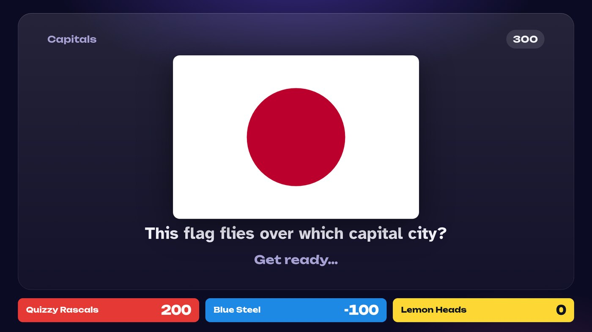 |
| The board | A picture question |
| 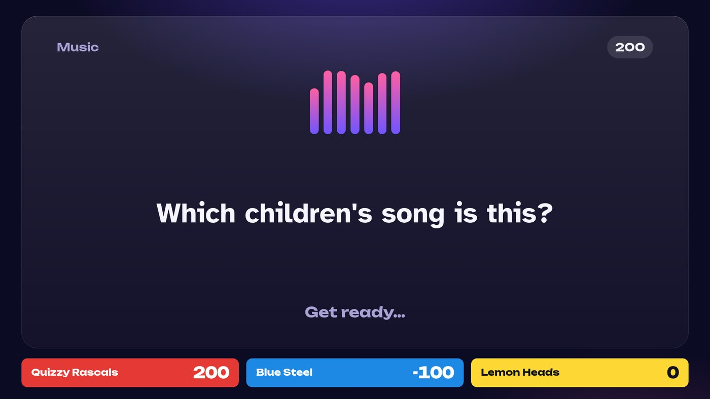 | 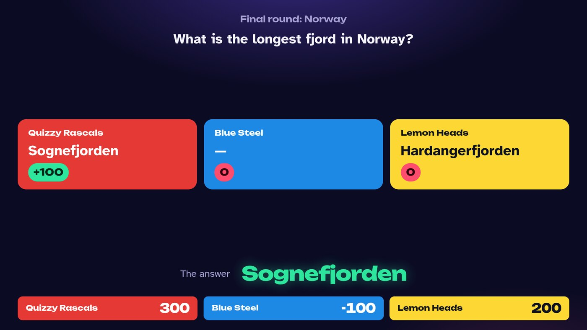 |
| A sound clip question | The final round, judged |
| 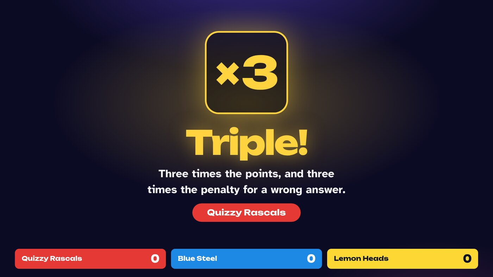 | 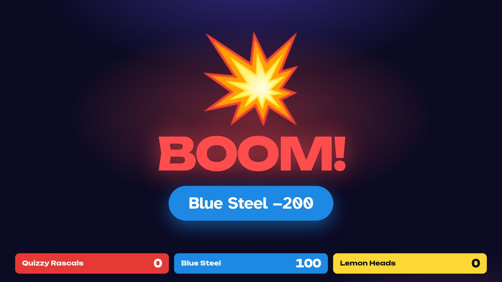 |
| Crazy mode: triple points | Crazy mode: the bomb |

**On the phones**

| | | | |
|---|---|---|---|
| 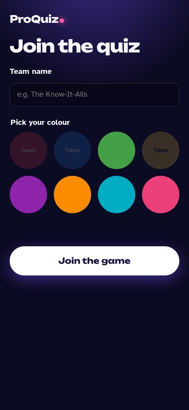 | 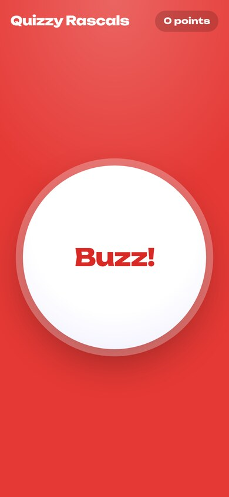 | 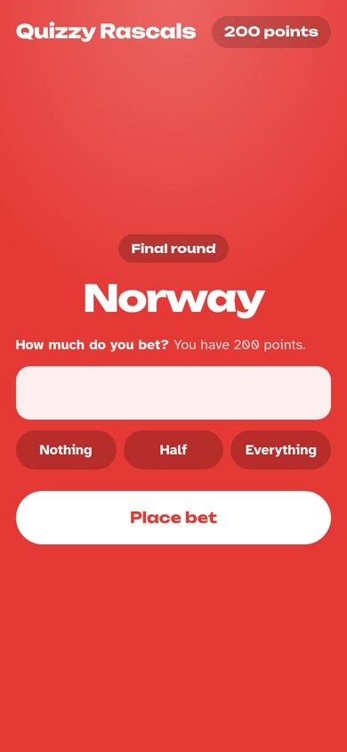 | 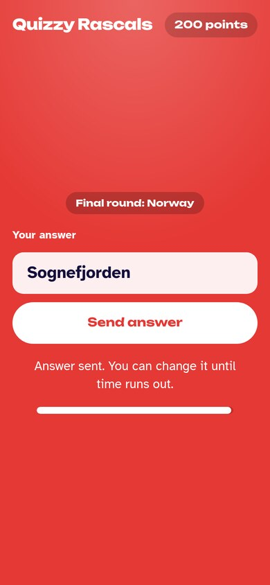 |
| Join with a name and colour | The buzzer | Bet in the final | Type the final answer |

**On the host laptop**

| | |
|---|---|
| 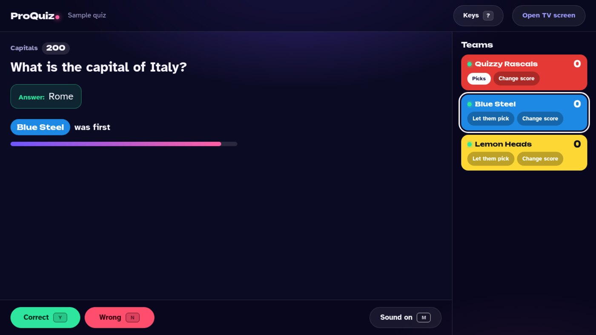 | 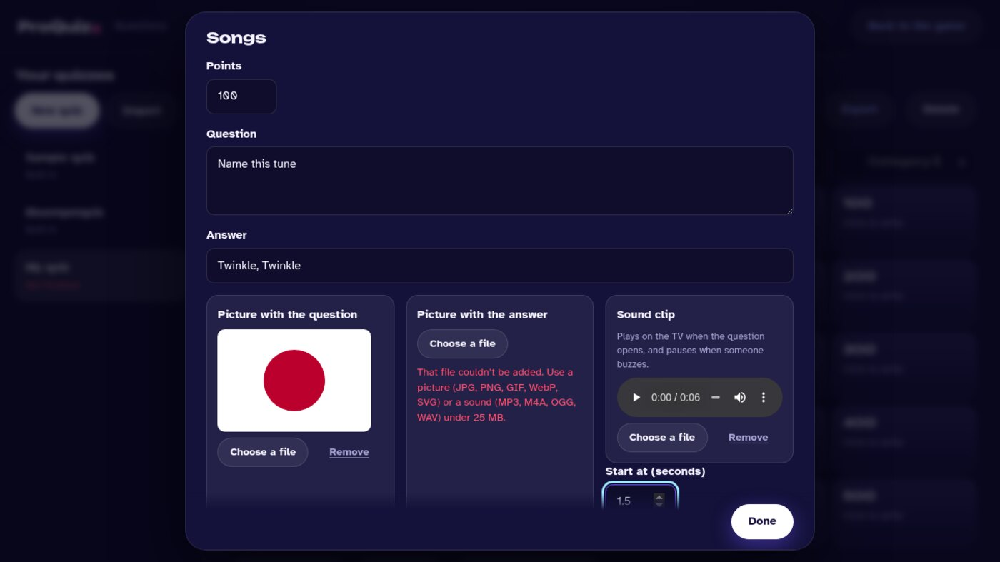 |
| Only you see the answer | The question editor |

## Get it

Download the zip for your computer from the [latest release](https://github.com/dbugger85/proquiz/releases/latest) and unzip it. There's nothing to install. Each zip has a "START HERE" note.

| Computer | Download |
|---|---|
| Windows | `ProQuiz-…-windows.zip` → double-click `ProQuiz.exe` |
| Mac from late 2020 onwards (M1, M2, …) | `ProQuiz-…-mac-apple-silicon.zip` → right-click `ProQuiz` → Open |
| Older Mac (Intel) | `ProQuiz-…-mac-intel.zip` → right-click `ProQuiz` → Open |
| Linux | `ProQuiz-…-linux-x64.zip` → run `./ProQuiz` |

- **Windows:** before you unzip, right-click the zip → **Properties** → tick **Unblock** → **OK**. Without this, Windows may refuse to start ProQuiz and offer only "Don't run". If it still warns, click **More info → Run anyway**. Then **Allow** network access, or phones can't connect. The program isn't signed (signing costs money), which is why Windows is careful.
- **Mac** blocks a normal double-click the first time for the same reason. Right-click → **Open** once, and allow incoming connections if asked.

## Before the night

1. Start ProQuiz. Your browser opens the **host screen**.
2. Click **Edit questions** to make your quiz. Click a tile to write its question and answer, and add a picture or sound clip if you like. The editor saves by itself, and a list under the board tells you what's missing. Two sample quizzes are included, in English and Norwegian.
3. Try it once with two phones, so you know how it feels.

**Ready-made quizzes to import** (download the file, then **Import** in the editor):
- [Barnequiz (5–8 år)](examples/barnequiz.proquiz.json): a Norwegian quiz for young children, about animals, colours and shapes, counting, fairy tales and cartoons, and nature, with two pictures.

## On the night

1. **Wi-Fi:** connect the laptop and all the phones to the **same Wi-Fi**.
2. **Start** ProQuiz. Keep its black (or Terminal) window open while you play.
3. **TV:** connect the laptop to the TV as a **second screen** (extend, not mirror). On the host screen click **Open TV screen**, drag that window onto the TV, and press **F** for full screen. Click the TV screen once so it's allowed to play sound.
   - If you can only mirror the screen, that works too: skip the TV screen and the laptop plays the sounds. The answers then show only when you reveal them.
4. **Teams join:** they scan the QR code on the TV, type a team name and pick a colour. They can press **Try your buzzer** to hear their tone.
5. **Settings:** in the lobby, choose the quiz, the language, what a wrong answer costs, the timers, and the music: on or off, the volume, and optionally your own music file for each moment (lobby, between questions, thinking, final, after the game).
6. **Start game.**

### Crazy mode (Kaosmodus)

Turn it on in the lobby's settings: **A little** hides about 3 special tiles on a 5×5 board, and **Lots** about 6. They land anywhere, and nobody (except you, on the laptop) knows where. Untick any specials you don't want under **Specials to use**. When a team picks one, the TV spins a reel and lands on the special. Press **Space** to go on.

| Special | What happens |
|---|---|
| ×3 **Triple** | Three times the points, and three times the penalty for every wrong answer |
| 💣 **Bomb** | No question: the picking team loses the tile's points |
| 🔥 **Hot seat** | Only the picking team may answer |
| 🛟 **Rescue** | The team in last place answers alone, and a wrong answer costs nothing |
| ⚡ **Turbo** | The picking team gets three questions in a row, 5 seconds each, with no penalty |
| 💰 **Jackpot** | Every point lost to wrong answers and bombs has gone into a secret pot. Answer right to win it |
| 🧊 **Freeze** | The picking team chooses a team that can't buzz on this question (you click it on the laptop) |

### Playing

| Key | What it does |
|---|---|
| Click a tile | Open the question the team picked |
| **Space** | Turn the buzzers on (after reading the question), or go back to the board |
| **Y** / **N** | The answer is correct / wrong |
| **R** | Show the answer (nobody got it) |
| **Esc** | Put the question back (picked by mistake) |
| **U** | Undo the last judgement or score change |
| **P** / **0** | Play or pause the sound clip / play it from the start |
| **M** | Sound effects on or off |
| **B** | Background music on or off |
| **E** | End the board early and go to the final round |
| **?** | Show all the keys |

You also have buttons to **Change score** and **Let them pick** for each team. In the final round, the teams bet on their phones, then type their answers. You mark each one **Correct** or **Wrong**, and it flips up on the TV.

## If something goes wrong

- **Phones can't connect.**
  - Check they're on the same Wi-Fi as the laptop, not mobile data.
  - Guest or hotel Wi-Fi often stops devices seeing each other. Turn on a hotspot on one phone and put the laptop and all the phones on it.
  - On Windows, check ProQuiz is allowed through the firewall.
- **A phone went to sleep or lost its connection.** Unlock it or reload the page. It comes back as the same team, with the same score.
- **The laptop crashed, or you closed ProQuiz.** Start it again. The host screen asks **Continue the last game?**
- **No sound.** Click the TV screen once. Check **Sound effects** is on and the TV isn't muted. Sound clips play from the TV screen, or from the laptop when no TV screen is open.

Your quizzes, their pictures and clips, and the autosave are kept in a **ProQuiz** folder in your home folder. Use **Export** in the editor to share a quiz, pictures and clips included, and **Import** to open one.

## For developers

```sh
npm install
npm start        # starts the server and opens the host page (PROQUIZ_NO_OPEN=1 to skip)
npm test         # unit and server tests
npm run e2e      # browser test with a host, a TV and three phones
npm run build    # the zips in dist/ (needs Deno and zip)
```

See [CLAUDE.md](CLAUDE.md) for how it's built and [PLAN.md](PLAN.md) for the plan and decisions.
